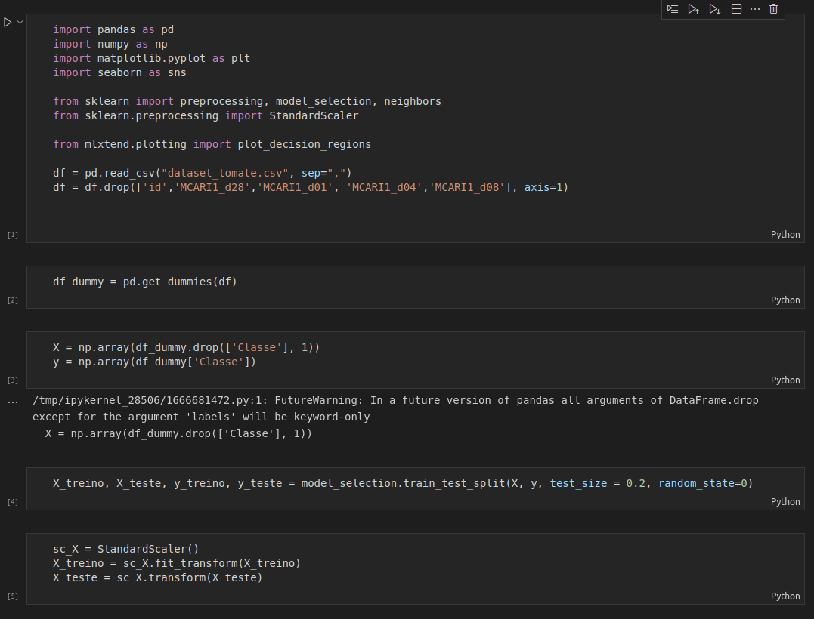

# Entrega Global Solution | IOT | TomateKnn

## <b>Grupo - NextStep</b>
<table>
    <tr>
        <th>Nome<th>
        <th>RM<th>
    </tr>
    <tr>
        <td>Celso Lorensatto da Silva Filho</td>
        <td>86158</td>
    </tr>
    <tr>
        <td>Eduardo Vinícius Benigno da Costa</td>
        <td>85915</td>
    </tr>
    <tr>
        <td>Gabriel Niimi de Oliveira</td>
        <td>85499</td>
    </tr>
    <tr>
        <td>Guilherme Rodriguero de Souza</td>
        <td>83850</td>
    </tr>
    <tr>
        <td>Rogério Pizzo dos Santos</td>
        <td>84088</td>
    </tr>
</table>

 

## <b>Link do Vídeo de Demonstração</b>

https://youtu.be/gXs5dPxUOm8

 

## <b>Como executar o projeto ?</b>

 

### Requisitos

* Python instalado no sistema
* Pip instalado no sistema para instalação dos pacotes

 

### 1 - Instalar os pacotes para execução do projeto

 

- Pandas
  ~~~Shell
  pip install pandas
  ~~~

- numpy
  ~~~Shell
  pip install numpy
  ~~~

- matplotlib
  ~~~Shell
  pip install matplotlib
  ~~~

- seaborn
  ~~~Shell
  pip install seaborn
  ~~~

- sklearn
  ~~~Shell
  pip install sklearn
  ~~~

- mlxtend
  ~~~Shell
  pip install mlxtend
  ~~~

 

### 2 - Instalar Um Notebook para execução

Pode ser qualquer Notebook para execução, o que vamos ensinar é com o Jupyter

 

- Instale o Jupyter Notebook
  ~~~Shell
  pip install jupyterlab
  ~~~

- Inicie o Jupyter pelo terminal
  ~~~Shell
  jupyter notebook
  ~~~

 

### 3 - Instrução para rodar o projeto

 

se Você executou todos os passos até aqui, simplesment execute o projeto na ordem:

